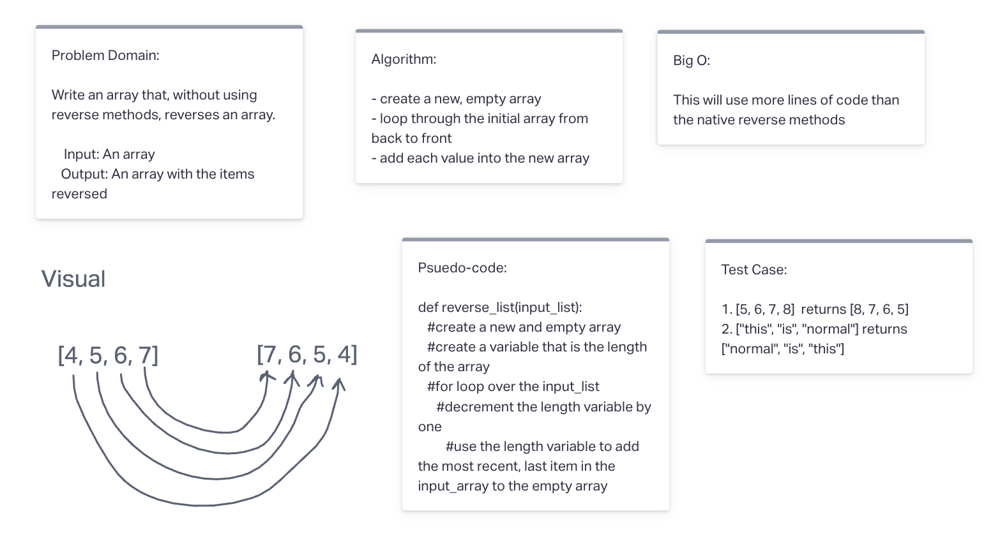

# Reverse an Array

Write an array that, without using reverse methods, reverses an array (An array in Python is called a list).

## Whiteboard Process

## Approach & Efficiency

For this challenge I took an approach that I think it pretty standard. I created a new lists that was empty and added the items from the input list to the empty list in reverse order.
