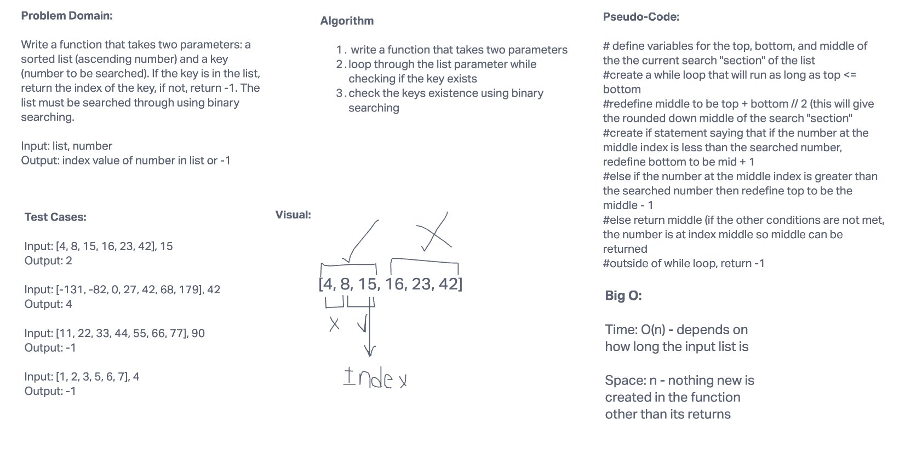

# Binary Search of Sorted Array

Write a function that takes two parameters: a sorted list of ascending numbers and a search key (number to be searched). Use binary searching to return the index of the key in the list. If the key does not exist in the list, return -1.

## Whiteboard Process

## Approach & Efficiency

I took the binary search method approach beause the challenge requred me to. If I had not been told about binary serach I would have used sequential search. From now on I am going to use binary when it is appropreate. Big O time is O(n) because it depends on the length of the array and space is n because nothing new is made in the function.
