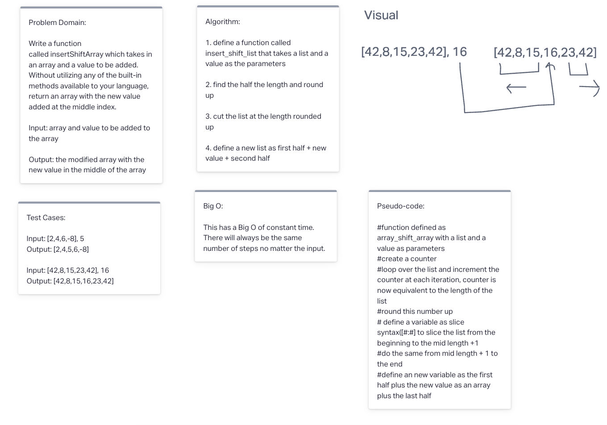

# Insert to Middle of an Array

Write a function called insertShiftArray which takes in an array and a value to be added. Without utilizing any of the built-in methods available to your language, return an array with the new value added at the middle index.

## Whiteboard Process

## Approach & Efficiency

I decided to split the array and add the new value as an array at the center. As for the Big O, There are a fixed number of steps so I belive that its a constant, but the for loop will run as many items there are which means it will take more time if the array is longer. I'm not sure if this makes the big O increase linerarly or not. I will be asking in class tomorrow.
