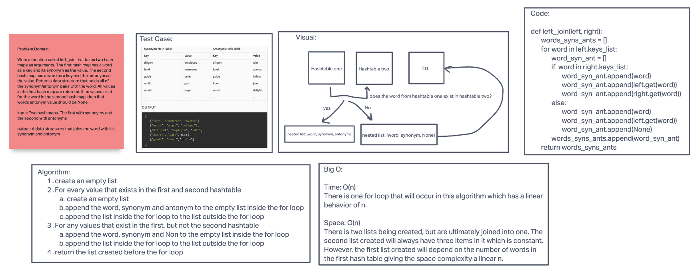

# Hashmap LEFT JOIN

Left join is meant to include all of the keys from the 'left' hashmap in the new datastructure. If a key exists in the right, but not the left, then the key is ignored.
If a key exists in the left, but not the right, then then the right value associated with that key in the new data struture will be `None`.

## Challenge

Write a function called left_join that takes two hash maps as arguments. The first hash map has a word as a key and its synonym as the value. The second hash map has a word as a key and the antonym as the value. Return a data structure that holds all of the synonym/antonym pairs with the word. All values in the first hash map are returned. If no values exist for the word in the second hash map, then that words antonym value should be None.

Input: Two hash maps. The first with synonyms and the second with antonyms

output: A data structures that joins the word with it's synonym and antonym

## Approach & Efficiency

Big O:

Time: O(n)
There is one for loop that will occur in this algorithm which has a linear behavior of n.

Space: O(n)
There is two lists being created, but are ultimately joined into one. The second list created will always have three items in it which is constant. However, the first list created will depend on the number of words in the first hash table giving the space complexity a linear n.

## Solution

