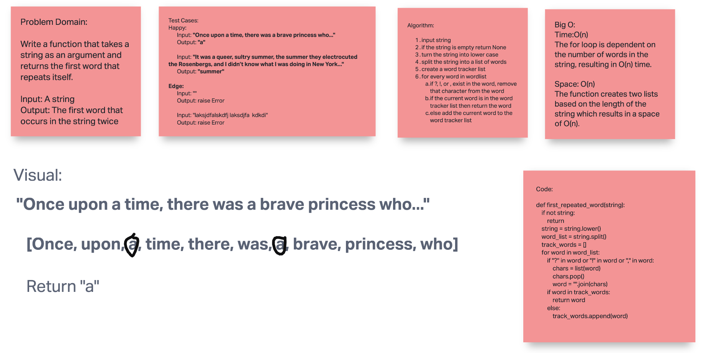

# Challenge Summary

Write a function that takes a string as an argument and returns the first word that repeats itself.

## Whiteboard Process

## Approach & Efficiency

Time:O(n)
The for loop is dependent on the number of words in the string, resulting in O(n) time.

Space: O(n)
The function creates two lists based on the length of the string which results in a space of O(n). e? Why? What is the Big O space/time for this approach? -->

## Solution

Run the code as a module. Run the test with `pytest` command.

Input: "apple? BANANA! banana, apple."
Output: "banana"
