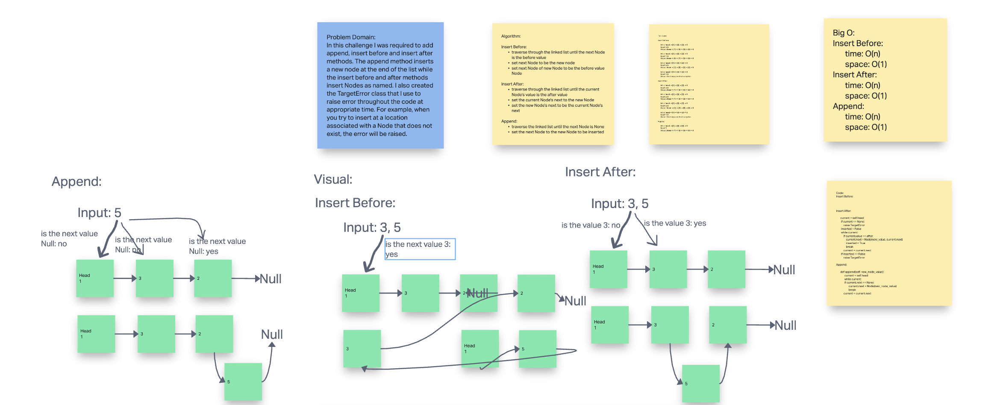

# Code Challenge 6: Linked List Insertions

## Challenge Summary

In this challenge I was required to add append, insert before and insert after methods. The append method inserts a new node at the end of the list while the insert before and after methods insert Nodes as named. I also created the TargetError class that I use to raise error throughout the code at approprate time. For example, when you try to insert at a location associated with a Node that does not exist, the error will be raised.

## Whiteboard

### Approach & Efficiency 6

append method:
  time: O(n)
  space: O(1)
insert_before method:
  time: O(n)
  space: O(1)
insert_after method:
  time: O(n)
  space: O(1)
TargetError class:
  time: O(1)
  space: O(1)

### Solution
<!-- Show how to run your code, and examples of it in action -->
- Use `pytest` to run the tests
- Do not directly call the Node class
- Call only the LinkedList class with wanted methods to create the desired linked list

## Link To Code

[GitHub](https://github.com/colegibbs/data-structures-and-algorithms/blob/main/python/data_structures/linked_list.py)
