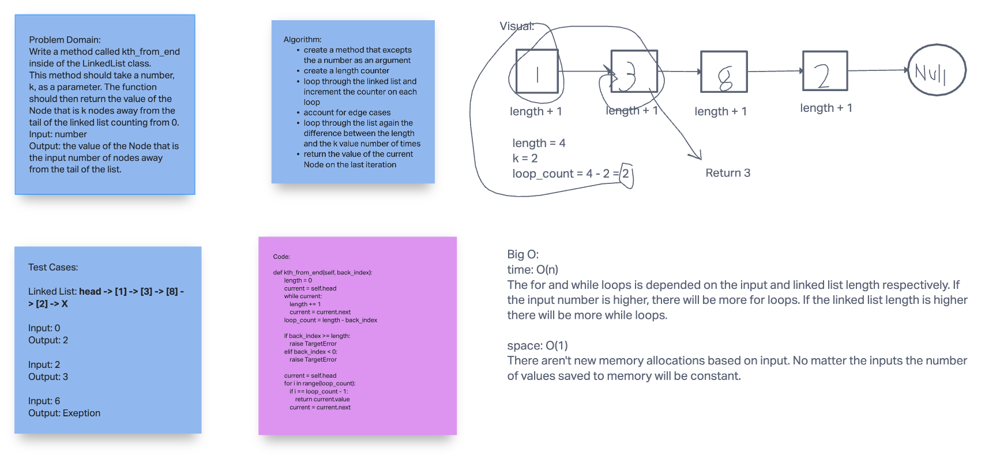

# Challenge Summary

Write a method called kth_from_end inside of the LinkedList class.
This method should take a number, k, as a parameter. The function should then return the value of the Node that is k nodes away from the tail of the linked list counting from 0.

Input: number

## Whiteboard Process

## Approach & Efficiency

I used the while loop incrementation as apposed to the insert methods incrementation to count the length of my list. The only reason I did this is because I couldn't seem to get the inser methods incrementation methods to work with the tests. I tried to use fixtures, but I must have been using them wrong because they acted as skips.

Big O:

time: O(n)
The for and while loops is depended on the input and linked list length respectively. If the input number is higher, there will be more for loops. If the linked list length is higher there will be more while loops.

space: O(1)
There aren't new memory allocations based on input. No matter the inputs the number of values saved to memory will be constant.

## Solution

To use this method call it on an instance of the LinkedList() class. This method will behave as described in challenge summary. If a negative or invalid number is entered (a number longer than or equal to the linked list length) then a TargetError is raised.
