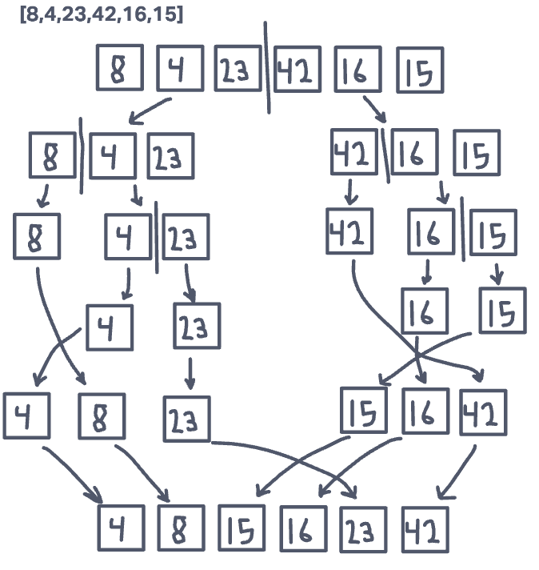

# Merge Sort Blog

## Resources

- [Geeks for Geeks Merge Sort](https://www.geeksforgeeks.org/python-program-for-merge-sort/)
I used this a refence to better understand the algorithm. I did my best not to copy the code. I was heavily influenced by this resource on the last two while loops that handle the imbalanced array cases.



This is a step through of the entire function. It is best for me to show it this way instead of step by stem. The recursion splits the array into sub arrays until it there is one item item in every array. The algorithm then sorts the individual array back up the recursion stack by left and right values. The first value is compared in every sub array to determine which will go first. The algorithm accounts for the sub arrays being lopsided with left and right while loops.

## Big 0

Space: O(n)
The space complexity is linear because the recursive calls creates two new arrays every time it is called. This means that the longer the input array, the more sub arrays will be created taking up memory linearly.

Time: O(n*log(n))
The time complexity is nlog(n) because the while loop will execute based on the length of the array which is n, while the recursive call will execute behavirally as log(n).

## Code

```python
def merge_sort(arr):
  n = len(arr)

  if n > 1:
    mid = n // 2
    left = arr[:mid]
    right = arr[mid:]
    merge_sort(left)
    merge_sort(right)
    # merge(left, right, arr)

    i = j = k = 0
    while i < len(left) and j < len(right):
      if left[i] <= right[j]:
        arr[k] = left[i]
        i += 1
      else:
        arr[k] = right[j]
        j += 1

      k += 1

    while i < len(left):
      arr[k] = left[i]
      i += 1
      k += 1

    while j < len(right):
      arr[k] = right[j]
      j += 1
      k += 1

```
